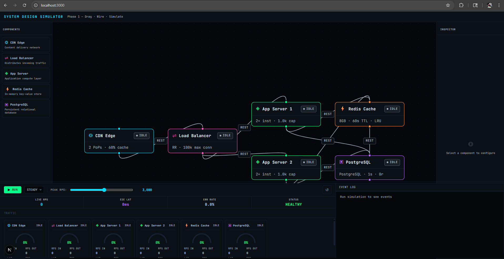

# System Design Simulator

A web-based interactive simulator for visualizing, designing, and experimenting with distributed system architectures. Built with Next.js, React, Zustand, and Tailwind CSS.



## Features

- **Drag-and-drop Canvas:** Build system architectures with nodes (App Server, Database, Cache, CDN, Load Balancer) and connect them with edges.
- **Live Simulation:** Simulate traffic, failures, and observe real-time metrics (RPS, latency, error rate, load).
- **Metrics Dashboard:** View global and per-node metrics, traffic sparkline, and event logs. Dashboard is draggable and resizable.
- **Context Menus:** Right-click nodes/edges for quick actions (delete, inspect, etc).
- **Customizable Nodes:** Node RPS depends on RAM/CPU; supports realistic scaling.
- **Event Log:** Track simulation events, warnings, and errors in real time.
- **Modern UI:** Dark, cinematic style with glassy panels and smooth interactions.

## Getting Started

### Prerequisites
- Node.js 18+
- npm or yarn

### Installation
```bash
npm install
# or
yarn install
```

### Running the App
```bash
npm run dev
# or
yarn dev
```

Open [http://localhost:3000](http://localhost:3000) in your browser.

## Project Structure

- `src/app/` — Next.js app entry, global layout, and styles
- `src/components/` — UI components
  - `canvas/` — System design canvas and node/edge components
  - `inspector/` — Inspector panels for node details
  - `shared/` — Shared UI widgets (charts, badges, etc)
  - `sidebar/` — Component library/sidebar
  - `simulation/` — Metrics dashboard, event log, simulation controls
- `src/constants/` — Component definitions
- `src/simulation/` — Simulation engine logic
- `src/store/` — Zustand stores for architecture and simulation state
- `src/templates/` — Default architecture templates
- `src/types/` — TypeScript types

## Customization
- **Styling:** Uses Tailwind CSS and custom CSS for a modern look.
- **State Management:** Zustand for fast, simple state updates.
- **Simulation Logic:** Easily extendable in `SimulationEngine.ts`.

## Contributing
Pull requests and issues are welcome! Please open an issue to discuss major changes.

## License
MIT
